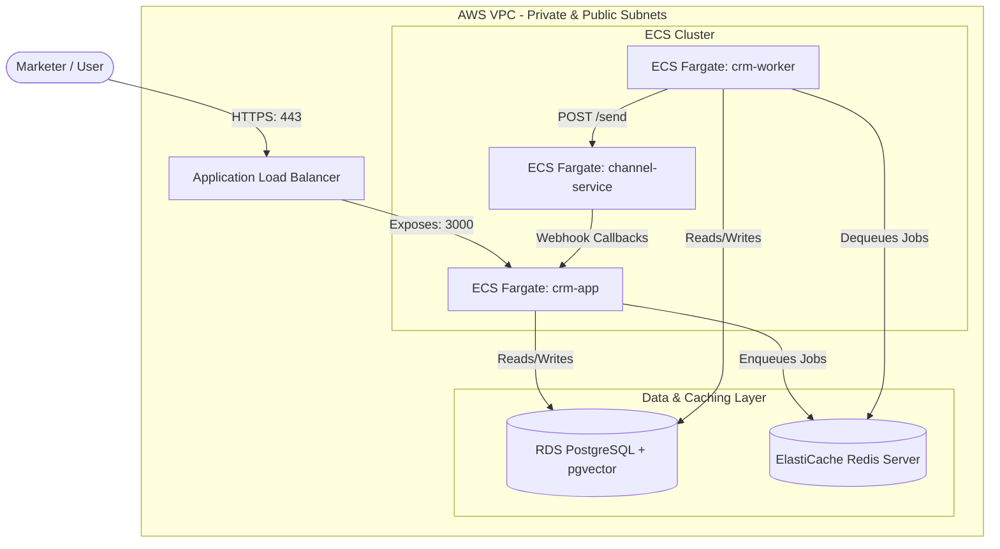

# AWS Hosting Guide - Xeno CRM Production Deployment

This guide describes how to deploy the containerized Xeno CRM application stack to Amazon Web Services (AWS) using production-grade best practices for security, scalability, and performance.

---

## 1. Production Architecture Overview

The production architecture separates the Next.js web application, the BullMQ worker, the Express channel service, and the database/cache layers to maximize availability and ensure zero-downtime deployments.



---

## 2. Option A: Production-Grade AWS Stack (ECS Fargate)

This is the recommended deployment for high-reliability, autoscaling production workloads.

### A. Managed Database: Amazon RDS PostgreSQL
1. Create an **RDS PostgreSQL 16** database instance.
2. Select a Multi-AZ deployment for high availability (recommended for production).
3. Ensure the security group allows inbound connections on port `5432` only from the ECS security group.
4. Once created, connect to the database and enable the vector extension:
   ```sql
   CREATE EXTENSION IF NOT EXISTS vector;
   ```

### B. Managed Cache: Amazon ElastiCache Redis
1. Create a serverless or clustered **ElastiCache Redis** replication group (version 7+).
2. Set the parameter group to support keep-alive options.
3. Configure the security group to allow inbound traffic on port `6379` only from the ECS security group.

### C. Container Registry: Amazon ECR
1. Create three **Elastic Container Registry (ECR)** repositories:
   - `xeno-crm-app`
   - `xeno-crm-worker`
   - `xeno-channel-service`
2. Authenticate your local Docker CLI to ECR:
   ```bash
   aws ecr get-login-password --region <region> | docker login --username AWS --password-stdin <aws_account_id>.dkr.ecr.<region>.amazonaws.com
   ```
3. Tag and push your built images:
   ```bash
   # CRM (Frontend & Web App)
   docker build -t xeno-crm-app -f apps/crm/Dockerfile .
   docker tag xeno-crm-app:latest <aws_account_id>.dkr.ecr.<region>.amazonaws.com/xeno-crm-app:latest
   docker push <aws_account_id>.dkr.ecr.<region>.amazonaws.com/xeno-crm-app:latest

   # Worker
   docker build -t xeno-crm-worker -f apps/crm/Dockerfile .
   docker tag xeno-crm-worker:latest <aws_account_id>.dkr.ecr.<region>.amazonaws.com/xeno-crm-worker:latest
   docker push <aws_account_id>.dkr.ecr.<region>.amazonaws.com/xeno-crm-worker:latest

   # Channel Service
   docker build -t xeno-channel-service -f apps/channel-service/Dockerfile .
   docker tag xeno-channel-service:latest <aws_account_id>.dkr.ecr.<region>.amazonaws.com/xeno-channel-service:latest
   docker push <aws_account_id>.dkr.ecr.<region>.amazonaws.com/xeno-channel-service:latest
   ```

### D. AWS ECS Fargate Task Definitions
Create Fargate Task Definitions for each service. Secure all credentials using **AWS Secrets Manager** and map them to container environment variables.

#### 1. CRM App Task (`crm-app`)
* **CPU / Memory**: 0.5 vCPU / 1 GB RAM
* **Port Mapping**: Container Port `3000` / HTTP
* **Essential Env Variables**:
  * `DATABASE_URL`: `postgresql://<db_user>:<db_pass>@<rds_endpoint>:5432/<db_name>?pgbouncer=true&connection_limit=5`
  * `DIRECT_URL`: `postgresql://<db_user>:<db_pass>@<rds_endpoint>:5432/<db_name>`
  * `REDIS_URL`: `rediss://<elasticache_redis_endpoint>:6379`
  * `OPENAI_API_KEY`: Secret reference to OpenAI Key.
  * `CHANNEL_SERVICE_URL`: `http://channel-service.local:4000` (resolves via AWS Cloud Map / ECS Service Discovery)
  * `WEBHOOK_BASE_URL`: `https://crm.yourdomain.com` (public domain)
  * `WEBHOOK_SECRET`: Secure webhook passphrase.
  * `NODE_ENV`: `production`

#### 2. Worker Task (`crm-worker`)
* **CPU / Memory**: 0.5 vCPU / 1 GB RAM
* **Command Override**: `pnpm,--filter,crm,worker`
* **Essential Env Variables**: (Mirror all values from the `crm-app` task).
* **Ports**: None (does not expose any ports).

#### 3. Channel Service Task (`channel-service`)
* **CPU / Memory**: 0.25 vCPU / 512 MB RAM
* **Port Mapping**: Container Port `4000` / HTTP
* **Essential Env Variables**:
  * `PORT`: `4000`
  * `NODE_ENV`: `production`

### E. Registering and Running ECS Services & Tasks

Follow these steps to deploy and execute your Fargate containers on AWS ECS:

#### 1. Create an ECS Cluster
1. Open the **Amazon ECS Console**.
2. Click **Create Cluster**.
3. Choose a Cluster Name (e.g., `xeno-cluster`).
4. Select **AWS Fargate (serverless)** as the infrastructure option and click **Create**.

#### 2. Create and Register Task Definitions
For each of the three services (`crm-app`, `crm-worker`, `channel-service`), create a **Task Definition**:
1. In the ECS Console sidebar, click **Task Definitions** -> **Create new task definition** (Fargate).
2. Configure task size (CPU/Memory as detailed in Section D above).
3. Under **Container details**:
   - Set the **Image URI** pointing to your ECR repository URL (e.g., `<aws_account_id>.dkr.ecr.<region>.amazonaws.com/xeno-crm-app:latest`).
   - Add environment variables and Secrets Manager references.
   - For `crm-worker`, add `pnpm,--filter,crm,worker` in the **Command** entry under the container settings overrides.
4. Click **Create** to register the task definition revision.

#### 3. Set Up AWS Cloud Map (Service Discovery)
To allow the background worker to locate the `channel-service` container internally using `http://channel-service.local:4000`:
1. In the AWS Console, search for **AWS Cloud Map** and create a private DNS namespace (e.g., `local`).
2. When creating the ECS Services, check **Enable Service Discovery** and associate the service with this namespace.

#### 4. Run the Web App and Channel Services as ECS Services
For always-on services (`crm-app`, `crm-worker`, and `channel-service`), deploy them as **Services** in your cluster:
1. In your ECS Cluster, go to the **Services** tab and click **Create**.
2. Set Launch Type as **Fargate**.
3. Select the respective task definition and revision.
4. Set the **Service Name** (e.g., `crm-app-service`).
5. Set the **Desired tasks** count to `1` (or more for autoscaling).
6. Under **Networking**:
   - Select your VPC and private subnets.
   - Select the security group configured to allow correct incoming traffic (see Security Group rules in Section 5).
7. Under **Load Balancing** (only for `crm-app` and optionally `channel-service`):
   - Choose your **Application Load Balancer** (ALB).
   - Set the container to balance (e.g., `crm-app` port `3000`).
   - Configure a target group and health check path (`/`).
8. Click **Create**.

---

## 3. Option B: Low-Cost EC2 Docker Compose Deployment

For staging, demos, or small teams, you can host the entire system on a single **AWS EC2** instance (e.g., `t3.medium`) using Docker Compose.

### Setup Instructions
1. Launch an **EC2 Instance** (Ubuntu 22.04 LTS recommended) in a public subnet.
2. Configure a **Security Group** to allow:
   - Port `22` (SSH) - restricted to your IP.
   - Port `80` (HTTP) & `443` (HTTPS) - open to all for frontend access.
3. Install Docker and Docker Compose on the instance, and configure permissions:
   ```bash
   sudo apt-get update
   sudo apt-get install -y docker.io docker-compose
   sudo systemctl enable --now docker

   # Add current user (ubuntu) to docker group to run docker commands without sudo
   sudo usermod -aG docker $USER
   # Activate group changes in the current session (or log out and log back in)
   newgrp docker
   ```
4. Clone the repository and configure the environment files:
   - Create a production `.env` inside `apps/crm/.env` and `apps/channel-service/.env` containing your database strings and API keys.
5. Launch the containers in detached mode:
   ```bash
   docker compose up --build -d
   ```
6. Seed the Database:
   Once the containers are running and healthy, seed the database with core records (e.g. products, customers, and mock orders) by executing the Prisma seed command inside the running CRM web container:
   ```bash
   docker exec -it xeno-crm-app pnpm db:seed
   ```

7. (Optional) Set up Nginx as a reverse proxy on port 80/443 and configure SSL certificates using Let's Encrypt / Certbot:

   **A. Install Nginx and Certbot on Ubuntu:**
   ```bash
   sudo apt-get update
   sudo apt-get install -y nginx certbot python3-certbot-nginx
   ```

   **B. Create Nginx Server Block:**
   Create a configuration file at `/etc/nginx/sites-available/xeno-crm` (replace `crm.yourdomain.com` with your actual domain):
   ```nginx
   server {
       listen 80;
       server_name crm.yourdomain.com;

       location / {
           proxy_pass http://localhost:3000;
           proxy_http_version 1.1;
           proxy_set_header Upgrade $http_upgrade;
           proxy_set_header Connection 'upgrade';
           proxy_set_header Host $host;
           proxy_cache_bypass $http_upgrade;
           proxy_set_header X-Real-IP $remote_addr;
           proxy_set_header X-Forwarded-For $proxy_add_x_forwarded_for;
           proxy_set_header X-Forwarded-Proto $scheme;
       }
   }
   ```

   **C. Enable Site and Restart Nginx:**
   ```bash
   # Link file to enable the site configuration
   sudo ln -s /etc/nginx/sites-available/xeno-crm /etc/nginx/sites-enabled/
   
   # Remove the default site configuration
   sudo rm -f /etc/nginx/sites-enabled/default
   
   # Test Nginx syntax and reload
   sudo nginx -t
   sudo systemctl restart nginx
   ```

   **D. Request SSL Certificate with Let's Encrypt:**
   Run Certbot to automatically fetch, configure, and renew SSL certificates for Nginx:
   ```bash
   sudo certbot --nginx -d crm.yourdomain.com
   ```
   *Certbot will configure Nginx to automatically redirect all HTTP traffic to HTTPS.*

---

## 4. Running Migrations and Seeding on AWS (ECS Fargate)

To run database migrations or seed the PostgreSQL database once the containers are running on AWS ECS:

### Run Database Migrations
Run a one-time ECS task override using the `crm-app` container:
```bash
aws ecs run-task \
  --cluster <your-cluster-name> \
  --task-definition <crm-app-task-definition> \
  --launch-type FARGATE \
  --network-configuration "awsvpcConfiguration={subnets=[<subnet-id>],securityGroups=[<security-group-id>],assignPublicIp=ENABLED}" \
  --overrides '{"containerOverrides": [{"name": "crm-app", "command": ["pnpm", "--filter", "crm", "exec", "prisma", "migrate", "deploy"]}]}'
```

### Seed the Database
Similarly, run the seeding script as a one-time task:
```bash
aws ecs run-task \
  --cluster <your-cluster-name> \
  --task-definition <crm-app-task-definition> \
  --launch-type FARGATE \
  --network-configuration "awsvpcConfiguration={subnets=[<subnet-id>],securityGroups=[<security-group-id>],assignPublicIp=ENABLED}" \
  --overrides '{"containerOverrides": [{"name": "crm-app", "command": ["pnpm", "db:seed"]}]}'
```

---

## 5. Security Group Configuration Rules

Keep the network secure by limiting traffic to only what is required:

| Source | Destination | Port | Protocol | Purpose |
| :--- | :--- | :--- | :--- | :--- |
| Public Internet | Application Load Balancer (ALB) | 80 / 443 | TCP | Public web traffic |
| ALB Security Group | `crm-app` Container Group | 3000 | TCP | Load balancer forward |
| ECS Container Group | `channel-service` Container | 4000 | TCP | Internal routing |
| ECS Container Group | RDS PostgreSQL Instance | 5432 | TCP | Database access |
| ECS Container Group | ElastiCache Redis Instance | 6379 | TCP | Queue broker & cache |
