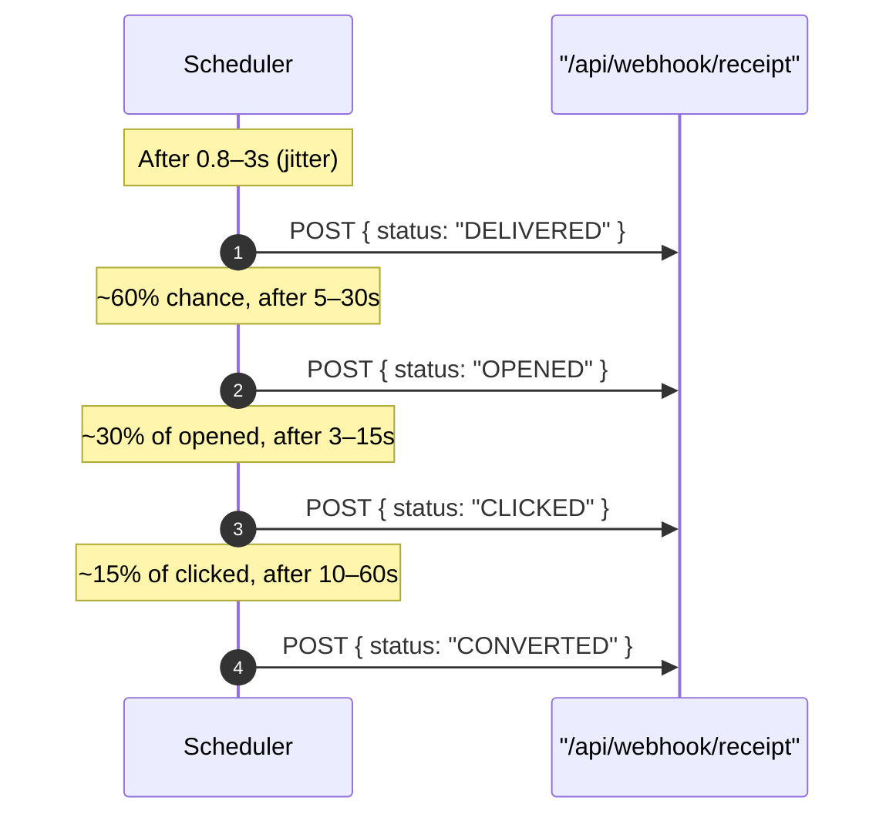
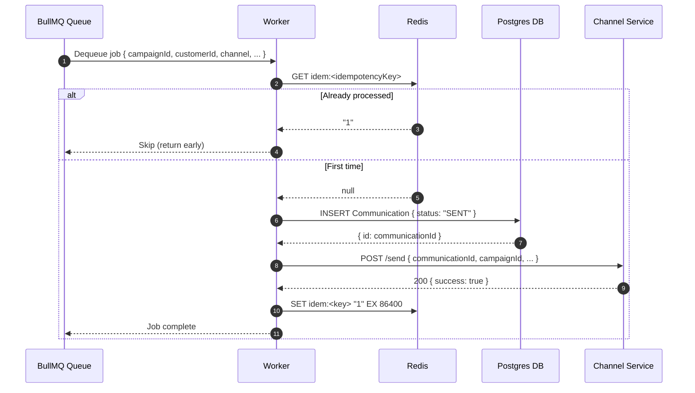
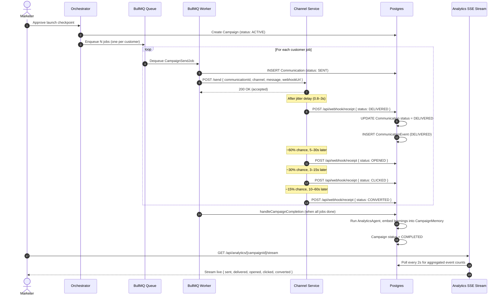

# Xeno CRM — Channel Service & BullMQ Worker Reference

This document describes the two components responsible for physically delivering campaign messages to customers: the **Channel Service** (a standalone Express micro-service) and the **BullMQ Worker** (a standalone Node.js process that bridges the CRM to the Channel Service).

---

## Table of Contents

1. [Architecture Overview](#1-architecture-overview)
2. [Channel Service](#2-channel-service)
   - [Entry Point & Middleware](#21-entry-point--middleware)
   - [POST /send](#22-post-send)
   - [Outcome Simulator](#23-outcome-simulator)
   - [Callback Scheduler](#24-callback-scheduler)
   - [Webhook Signing](#25-webhook-signing)
3. [BullMQ Worker](#3-bullmq-worker)
   - [Queue & Configuration](#31-queue--configuration)
   - [Idempotency Layer](#32-idempotency-layer)
   - [Message Send Flow](#33-message-send-flow)
   - [Error Handling & Retry Policy](#34-error-handling--retry-policy)
   - [Campaign Completion Handler](#35-campaign-completion-handler)
   - [Stale-Sweep Background Job](#36-stale-sweep-background-job)
   - [Graceful Shutdown](#37-graceful-shutdown)
4. [End-to-End Data Flow](#4-end-to-end-data-flow)
5. [Environment Variables](#5-environment-variables)
6. [Running Locally](#6-running-locally)
7. [Key Design Decisions](#7-key-design-decisions)

---

## 1. Architecture Overview

```mermaid
graph TD
    Orchestrator[Orchestrator: launchCampaign] -->|Enqueues N jobs| BullQ[(BullMQ Queue: campaign-send)]
    BullQ -->|Picks up jobs| Worker[BullMQ Worker - standalone process]
    Worker -->|POST /send| ChannelService[Channel Service - port 4000]
    Worker -->|Creates row| DB[(Postgres: Communication table)]
    ChannelService -->|Simulates delivery| Simulator[Outcome + Scheduler Simulator]
    Simulator -->|Fires webhook events| WebhookRoute[/api/webhook/receipt]
    WebhookRoute -->|Updates status| DB
    DB -->|Aggregated by SSE| Analytics[Live Analytics Stream]
```

**Separation of concerns:**
- The **CRM (Next.js)** orchestrates campaigns and persists state.
- The **BullMQ Worker** is a dedicated Node.js process that reads jobs from Redis and calls out to the Channel Service. It runs independently of Next.js — it can be scaled, restarted, or crashed without affecting the web server.
- The **Channel Service** is a lightweight Express micro-service simulating real-world channel delivery with probabilistic outcomes and realistic engagement cascades.

---

## 2. Channel Service

**Location:** `apps/channel-service/src/`  
**Port:** `4000` (configurable via `PORT` env var)  
**Start command:** `pnpm --filter channel-service dev`

### 2.1 Entry Point & Middleware

```
apps/channel-service/src/index.ts
```

The service bootstraps with:
- **`pino-http`** for structured request/response logging.
- **`express.json()`** for JSON body parsing.
- **`GET /health`** — lightweight health check endpoint returning `{ ok: true, service: "channel-service", timestamp }`. Used by the worker to verify connectivity.
- **`POST /send`** — the single operational route (see below).

### 2.2 POST /send

```
apps/channel-service/src/routes/send.ts
```

**Request Schema (validated with Zod):**

| Field             | Type                                   | Required | Description                                  |
|-------------------|----------------------------------------|----------|----------------------------------------------|
| `communicationId` | `string`                               | ✅       | DB row ID from the `Communication` table     |
| `campaignId`      | `string`                               | ✅       | Parent campaign reference                    |
| `customerId`      | `string`                               | ✅       | Recipient customer ID                        |
| `channel`         | `"whatsapp" \| "email" \| "sms" \| "rcs"` | ✅  | Delivery channel                             |
| `message`         | `string` (min 1)                       | ✅       | Message body text                            |
| `subject`         | `string`                               | ❌       | Email subject line (required for email)      |
| `webhookUrl`      | `string` (URL)                         | ✅       | Where to POST delivery status callbacks      |

**Success Response:**
```json
{
  "success": true,
  "communicationId": "clxyz...",
  "message": "Message accepted for whatsapp delivery"
}
```

**Error Responses:**
- `400 Bad Request` — Zod validation failure, returns `{ error, issues[] }`.
- `500 Internal Server Error` — unexpected exception.

**Processing flow:**
1. Validate the request body with Zod.
2. Simulate the delivery outcome using `simulateOutcome(channel)`.
3. Schedule async webhook callbacks using `scheduleCallbacks(...)`.
4. Immediately return `200 OK` — the channel service is **fire-and-forget** from the worker's perspective.

### 2.3 Outcome Simulator

```
apps/channel-service/src/simulator/outcome.ts
```

Randomly selects an outcome (`delivered | failed | bounced`) based on per-channel probability weights modelled on real-world industry benchmarks:

| Channel   | Delivered | Failed | Bounced |
|-----------|-----------|--------|---------|
| WhatsApp  | 88%       | 7%     | 5%      |
| Email     | 72%       | 15%    | 13%     |
| SMS       | 80%       | 12%    | 8%      |
| RCS       | 75%       | 15%    | 10%     |

The outcome is determined by a single `Math.random()` call against a cumulative probability walk.

### 2.4 Callback Scheduler

```
apps/channel-service/src/simulator/scheduler.ts
```

After accepting a message, the scheduler fires a **cascade of webhook callbacks** with realistic jitter to simulate an actual message delivery lifecycle:



**Cascade rules:**
- `FAILED` or `BOUNCED` outcomes fire only the terminal status event — no further callbacks are triggered.
- Each event fires independently after a random delay within the defined range (jitter prevents thundering-herd on the CRM webhook endpoint).
- Engagement rates (60% open, 30% click, 15% convert) reflect realistic Nike email/WhatsApp benchmarks.

**Delay ranges (in milliseconds, shortened for demo):**

| Event     | Min   | Max    |
|-----------|-------|--------|
| DELIVERED | 800   | 3,000  |
| OPENED    | 5,000 | 30,000 |
| CLICKED   | 3,000 | 15,000 |
| CONVERTED | 10,000| 60,000 |

### 2.5 Webhook Signing

Every outgoing callback request is signed with an HMAC-SHA256 signature using the shared `WEBHOOK_SECRET` environment variable:

```
X-Xeno-Signature: sha256=<hex-digest>
```

The CRM's `/api/webhook/receipt` handler verifies this signature before processing any status update to prevent spoofed events.

---

## 3. BullMQ Worker

**Location:** `apps/crm/lib/queue/worker.ts`  
**Type:** Standalone Node.js process (NOT part of Next.js)  
**Start command:** `pnpm worker` (alias for `tsx --env-file .env lib/queue/worker.ts`)

### 3.1 Queue & Configuration

```typescript
const worker = new Worker<CampaignSendJob>("campaign-send", handler, {
  connection: new Redis(config.REDIS_URL, { maxRetriesPerRequest: null }),
  concurrency: 20,        // Process up to 20 jobs in parallel
  limiter: { max: 100, duration: 1000 }, // Max 100 jobs/second rate limit
});
```

- **Queue name:** `campaign-send`
- **Job type:** `CampaignSendJob` (from `@xeno/shared-types`)
- **Concurrency:** 20 simultaneous in-flight jobs per worker process.
- **Rate limit:** 100 jobs/second to avoid hammering the Channel Service.
- **Redis connection:** Two separate `ioredis` connections — one for the worker itself, one for idempotency key management.

**`CampaignSendJob` shape:**
```typescript
{
  campaignId: string;
  customerId: string;
  channel: "whatsapp" | "email" | "sms" | "rcs";
  message: string;
  subject?: string;
  idempotencyKey: string; // deterministic: `${campaignId}:${customerId}`
}
```

### 3.2 Idempotency Layer

Before processing any job, the worker checks a Redis key to prevent duplicate deliveries:

```typescript
// Check: has this job been processed?
const alreadySent = await redis.get(`idem:${idempotencyKey}`);

// After success: mark as seen for 24 hours
await redis.set(`idem:${idempotencyKey}`, "1", "EX", 86400);
```

- **Key format:** `idem:<campaignId>:<customerId>`
- **TTL:** 86,400 seconds (24 hours)
- **Purpose:** Prevents a customer receiving the same campaign message twice if BullMQ retries a job after a transient failure that already partially succeeded.

### 3.3 Message Send Flow



**Step-by-step breakdown:**
1. Worker dequeues the job from BullMQ (`campaign-send` queue in Redis).
2. Checks idempotency — skips if already processed.
3. Creates a `Communication` row in Postgres with `status: "SENT"` before calling the Channel Service (ensures the webhook has a row to update).
4. POSTs to `CHANNEL_SERVICE_URL/send` with full payload including the webhook callback URL.
5. On `200 OK`: marks the idempotency key in Redis and marks the job done.
6. On `4xx`: throws `UnrecoverableError` — job is moved to the failed state without retrying.
7. On `5xx` or network error: throws a regular `Error` — BullMQ retries according to the job's retry policy.

### 3.4 Error Handling & Retry Policy

| Scenario                             | Action                                                         |
|--------------------------------------|----------------------------------------------------------------|
| Channel service unreachable (network) | Throw `Error` → BullMQ retries (exponential backoff)          |
| Channel service `4xx` response       | Throw `UnrecoverableError` → No retry, job permanently failed  |
| Channel service `5xx` response       | Throw `Error` → BullMQ retries                                |
| Idempotency key already set          | Return early (skip) — no error, job marked as complete         |

```typescript
worker.on("failed", (job, err) => {
  logger.error({ jobId: job?.id, campaignId: job?.data.campaignId, err },
    "[WORKER] ❌ Job failed permanently (exhausted retries)");
});

worker.on("error", (err) => {
  logger.error({ err }, "[WORKER] Worker-level error");
});
```

### 3.5 Campaign Completion Handler

After each job completes, the worker fires `handleCampaignCompletion(campaignId)` asynchronously (non-blocking, errors are caught and logged separately):

```typescript
handleCampaignCompletion(campaignId).catch((err) =>
  logger.error({ campaignId, err }, "[WORKER] Campaign completion handler failed")
);
```

**What `handleCampaignCompletion` does:**
1. Counts the total `Communication` rows for the campaign.
2. Checks if all communications have a terminal status (DELIVERED, FAILED, or BOUNCED).
3. If all are done: calls the **Analytics Agent** to aggregate performance metrics and generate a learning embedding.
4. Updates the campaign `status` to `COMPLETED` in the DB.

### 3.6 Stale-Sweep Background Job

On worker startup, `startStaleSweep()` begins a periodic background interval that scans for `Communication` rows stuck in `SENT` status beyond a configurable timeout (e.g., 5+ minutes). This handles the case where the Channel Service crashes mid-delivery and never fires callbacks, leaving rows in a permanently-pending state.

```
apps/crm/lib/queue/jobs/stale-sweep.ts
```

The sweep:
1. Queries `Communication` where `status = "SENT"` and `createdAt < now - staleThreshold`.
2. Marks them as `FAILED` with a `reason: "stale_sweep"` note.
3. Triggers `handleCampaignCompletion` for affected campaigns so they can be finalized.

### 3.7 Graceful Shutdown

The worker listens for `SIGTERM` and shuts down cleanly:

```typescript
process.on("SIGTERM", async () => {
  clearInterval(sweepTimer);   // Stop stale sweep
  await worker.close();        // Wait for in-flight jobs to complete
  await redis.quit();          // Close Redis connections
  logger.info("[WORKER] Shut down gracefully");
  process.exit(0);
});
```

This ensures in-flight jobs are not abandoned mid-execution during deployment restarts or container orchestration (e.g., Kubernetes rolling updates).

---

## 4. End-to-End Data Flow

Below is the complete lifecycle of a single campaign message from queue enqueue to analytics recording:



---

## 5. Environment Variables

### Channel Service (`apps/channel-service/.env`)

| Variable         | Default                   | Description                                      |
|------------------|---------------------------|--------------------------------------------------|
| `PORT`           | `4000`                    | Port the Express server listens on               |
| `WEBHOOK_SECRET` | `dev-secret-change-me`    | Shared HMAC secret for signing webhook payloads  |

### BullMQ Worker (`apps/crm/.env`)

| Variable              | Example                          | Description                                           |
|-----------------------|----------------------------------|-------------------------------------------------------|
| `REDIS_URL`           | `redis://localhost:6379`         | Redis connection string for BullMQ and idempotency    |
| `CHANNEL_SERVICE_URL` | `http://localhost:4000`          | Base URL of the Channel Service                       |
| `WEBHOOK_BASE_URL`    | `http://localhost:3000`          | Base URL of the CRM (for building webhook callback URLs) |
| `DATABASE_URL`        | `postgresql://...`               | Prisma connection string to Postgres                  |
| `WEBHOOK_SECRET`      | `dev-secret-change-me`           | Must match the Channel Service's `WEBHOOK_SECRET`     |

> ⚠️ **Important**: `WEBHOOK_SECRET` must be identical in both services. A mismatch will cause all webhook receipts to be rejected with `401 Unauthorized`.

---

## 6. Running Locally

Start all three components in separate terminals:

```bash
# Terminal 1 — CRM (Next.js)
cd apps/crm
pnpm dev

# Terminal 2 — Channel Service (Express)
cd apps/channel-service
pnpm dev

# Terminal 3 — BullMQ Worker (standalone Node)
cd apps/crm
pnpm worker
```

Verify the Channel Service is up:
```bash
curl http://localhost:4000/health
# → { "ok": true, "service": "channel-service", "timestamp": "..." }
```

Redis must be running locally (or via Docker):
```bash
docker run -d -p 6379:6379 redis:7-alpine
```

---

## 7. Key Design Decisions

| Decision                                   | Rationale                                                                                                   |
|--------------------------------------------|-------------------------------------------------------------------------------------------------------------|
| **Worker is standalone, not in Next.js**   | Next.js serverless functions time out (Vercel: 60s max). A persistent worker process can handle hour-long campaigns without interruption. |
| **Channel Service is a separate micro-service** | Decouples delivery simulation/logic from the CRM. In production, this would be replaced by a real Twilio/SES/WhatsApp BSP adapter without touching the CRM. |
| **Idempotency via Redis keys (24h TTL)**   | BullMQ retries can cause duplicate deliveries after partial success. Redis keys are cheaper than a DB constraint and expire automatically. |
| **Communication row created BEFORE calling Channel Service** | Guarantees the webhook has a valid row to update even if the worker crashes mid-send. Prevents orphaned webhook events. |
| **Fire-and-forget webhook cascade**        | The Channel Service accepts immediately and fires events asynchronously — matching real BSP behaviour (e.g., WhatsApp Cloud API). |
| **`UnrecoverableError` on 4xx**            | A 4xx means the request is malformed (wrong schema, invalid channel). Retrying would always fail — using `UnrecoverableError` prevents wasting retry budget. |
| **Stale sweep on worker startup**          | Handles the edge case of Channel Service crashing between accepting the request and firing callbacks, which would leave `Communication` rows permanently in `SENT` status. |
| **Concurrency: 20, Rate: 100/s**           | Balances throughput for 10,000-customer campaigns (~8-10 minutes to dispatch) against Channel Service load and Redis pressure. |
