# Xeno CRM - System Design, Assumptions, Seeding, and Data Flow Specifications

This document details the system design, environment assumptions, database structures, routes, and AI agent architectures for Xeno CRM — an AI-native Campaign Platform built for Nike.

---

## 1. Environment & Architecture Assumptions

### 1.1 Technical Assumptions
* **Framework**: Next.js (app router) running a Turbopack dev environment.
* **Database**: PostgreSQL with the `pgvector` extension enabled. Vectors are 1536-dimensional (OpenAI `text-embedding-ada-002`).
* **Message Queue**: BullMQ powered by a Redis connection for handling bulk message execution jobs asynchronously.
* **Streaming Protocol**: Server-Sent Events (SSE) via HTTP for streaming live orchestrator thinking logs and campaign analytics reports in real-time.
* **AI Engine**: OpenAI GPT-4o (for heavy semantic reasoning and text content drafting) and GPT-4o-mini (for fast tasks like SQL validation, product categorization, and channel recommendations).

### 1.2 Business & Brand Assumptions (Nike Context)
* **Demographics**: Focuses on performance-driven athletes and fitness enthusiasts aged 18–45.
* **Tone**: Bold, motivational, conversational, "Just Do It" brand voice guidelines.
* **Content Exclusions**: No competitor comparisons, no heavy discounting, and no price-first messaging.
* **CTAs**: Focused on urgency, value, and brand collections rather than simple discounts.
* **Preferred Channels**: Email (default), WhatsApp, SMS, and RCS.

---

## 2. Database Schema & Seeding Details

### 2.1 Schema Architecture
The database consists of 9 core tables:
1. `Customer`: Stores customer metadata (name, email, age, city, tier: standard, silver, gold, elite).
2. `Product`: Stores item attributes (name, category, price, SKU, in-stock status).
3. `Order`: Links Customers to Products with transaction amounts, quantity, and timestamps.
4. `Campaign`: Represents a launched marketing push containing the message copy, SQL criteria, and channels.
5. `Communication`: An individual message entry dispatched to a Customer.
6. `CommunicationEvent`: Tracks events related to a message (SENT, DELIVERED, OPENED, CLICKED, CONVERTED).
7. `OrchestratorRun`: Keeps track of the state machine for active AI sessions and checkpoint edits.
8. `CampaignMemory`: Vector database store containing embeddings of past campaign lessons and CTR performance metrics.
9. `Settings`: General JSON configuration items (e.g. brand memory guidelines).

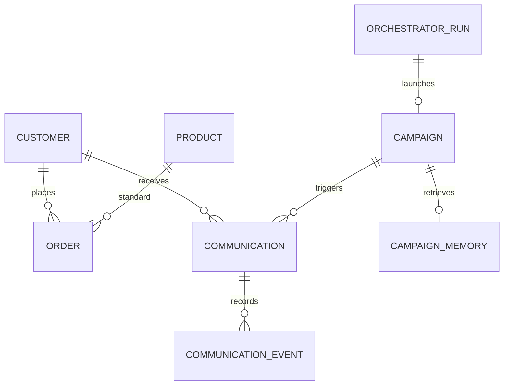

### 2.2 Seeding Configuration (`seed.ts`)
The seed script populates the database with:
* **Brand Memory Settings**: Upserts brand identity JSON containing Nike properties (motivational voice guidelines, preferred channels, exclusion keywords).
* **Products (49 items)**: Hardcoded catalog representing standard Nike divisions (Running, Basketball, Lifestyle, Training, Apparel, Accessories).
* **Customers (10,000 entries)**: Generates records with:
  * Weighted tiers: Standard (55%), Silver (25%), Gold (15%), Elite (5%).
  * Weighted Indian & Global cities (Mumbai 18%, Delhi 16%, Bangalore 15%, New York 3%, etc.).
  * Fake age distributions (16–55) and gender identities.
* **Orders (~25,000 transactions)**: Simulates historic purchase behavior with:
  * Weighted purchase category splits (Running 35%, Lifestyle 30%, Basketball 15%, etc.).
  * Skewed temporal frequency: 30% recent (0–90 days), 70% dormant (90–730 days).
  * Auto-discounts applied to exactly 15% of transactions.

---

## 3. Route & Endpoint Specifications

### 3.1 Orchestration Start: `POST /api/orchestrator/start`
Starts a campaign orchestration process. It validates input parameters, initializes an `OrchestratorRun` DB log with a `RUNNING` status, and triggers Stage 1 background tasks.

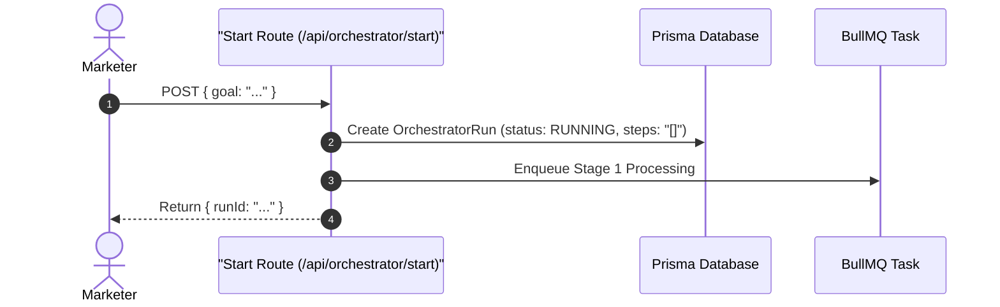

### 3.2 Real-time Live Log Stream: `GET /api/orchestrator/[runId]/stream`
Establishes a Server-Sent Events (SSE) channel. It keeps the connection alive, queries the `OrchestratorRun.steps` database, and streams changes to the client as events occur.

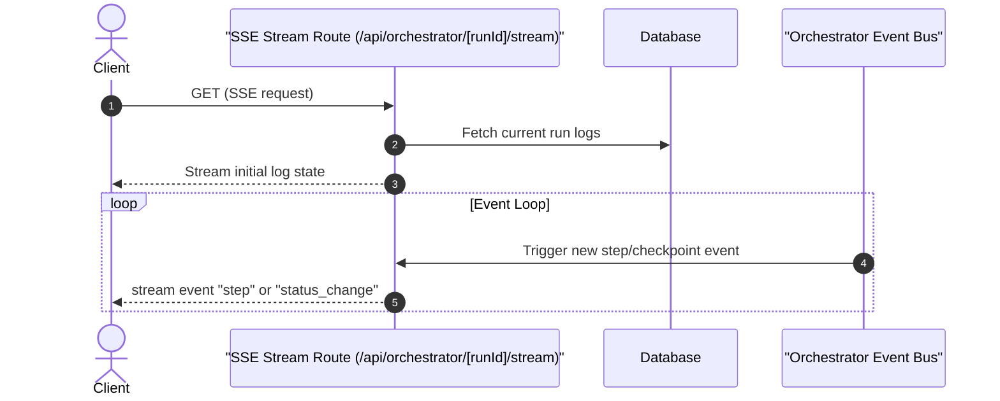

### 3.3 Checkpoint Approvals & Edits: `POST /api/orchestrator/[runId]/approve`
Processes a checkpoint submission. It updates target fields with marketer modifications (edits), steps the state machine to the next phase, and schedules subsequent background agents.

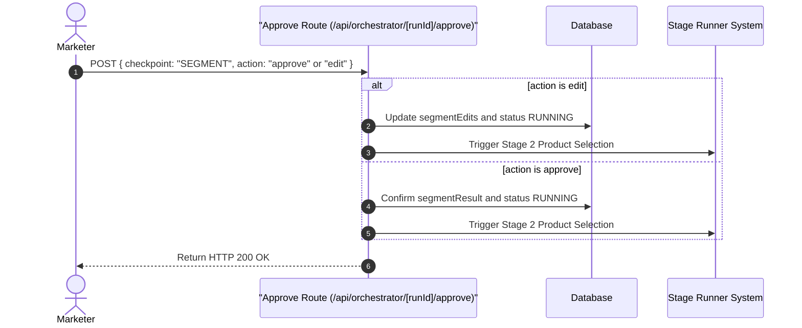

### 3.4 Live Analytics Delivery: `GET /api/analytics/[campaignId]/stream`
Streams live conversion, open, and delivery stats for a live campaign by querying `Communication` and `CommunicationEvent` records.

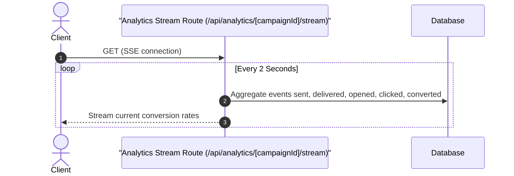

---

## 4. AI Agent System Design

The system runs a **Human-in-the-Loop (HITL)** architecture split into 4 sequential stages. At the end of each stage, state updates are written to the database and the run shifts to an `AWAITING_[STAGE]_APPROVAL` status, blocking downstream progression until approved by a human operator.

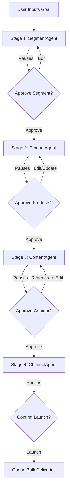

### 4.1 Segment Agent (`segment-agent.ts`)
Converts natural language specifications into validated read-only SQL queries targeting the Prisma database.

* **Input**: Audience objective in plain English.
* **LLM Call**: Instructs GPT-4o-mini using constraints (case-sensitive double-quoted table names, mandatory aggregations, forbidden subqueries).
* **SQL Validation**: Automatically executes `SELECT COUNT(*)` on the generated SQL with a scan cap of 50,000. If it throws a Postgres error, the agent logs the error and triggers a run failure.
* **Output**: Valid SQL query, inferred product category, and list of matching sample customers.

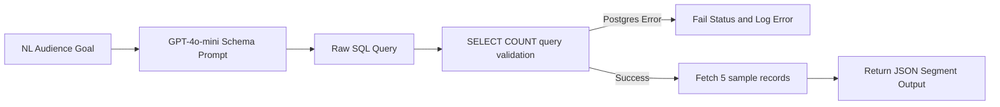

### 4.2 Product Agent (`product-agent.ts`)
Recommends products corresponding to the inferred category and target segment characteristics.

* **Input**: Campaign goal description and inferred category.
* **Category Search**: Injects products matching the target category.
* **Vector Semantic Match**: Generates embeddings of product descriptions and queries the database using pgvector cosine similarity (`<=>`) to match against the campaign goal context.
* **Fallback Strategy**: If no vector matches are above the `0.6` similarity threshold, it runs direct category queries on the database, preventing empty product catalogs.
* **Output**: Top 3 primary products and top 3 cross-sell recommendations.

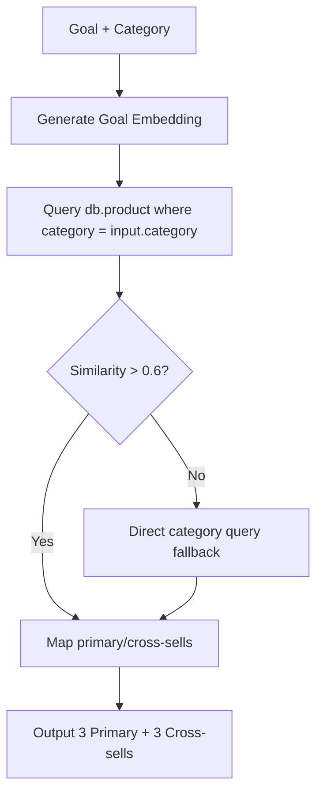

### 4.3 Content Agent (`content-agent.ts`)
Generates localized, brand-compliant campaign message copy.

* **Input**: Target channel, audience description, product list, tone guidelines, and optional regeneration feedback.
* **LLM Call**: Calls GPT-4o with brand memory values (exclusions, CTAs, voice themes) and channel parameters (SMS: max 160 characters, no links/emojis; WhatsApp: max 1024 characters; Email: requires subject).
* **Zod Validation**: Validates output formatting against `ContentOutputSchema`.
* **SMS Retry Loop**: If the channel is SMS and character counts exceed 160, it automatically runs a retry loop with strict length guidelines.
* **Output**: Message body, headline, subject line, CTA button, and character count.

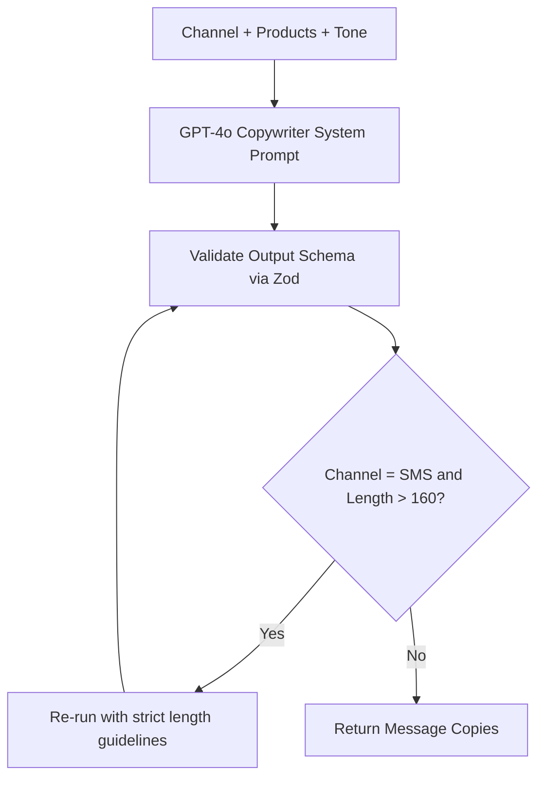

### 4.4 Channel Agent (`channel-agent.ts`)
Selects the target delivery channel based on actual performance.

* **Input**: Audience query description.
* **Database Aggregation**: Runs a SQL query aggregating historical metrics grouped by channel (`avgOpenRate`, `avgCtr`, `avgDeliveryRate`, `sampleSize`) where sample size is greater than 5.
* **LLM Selection**: Injects aggregate data and audience context into GPT-4o-mini to select the channel with the best conversion potential.
* **Output**: Recommended channel, confidence score, channel stats, and reasoning description.

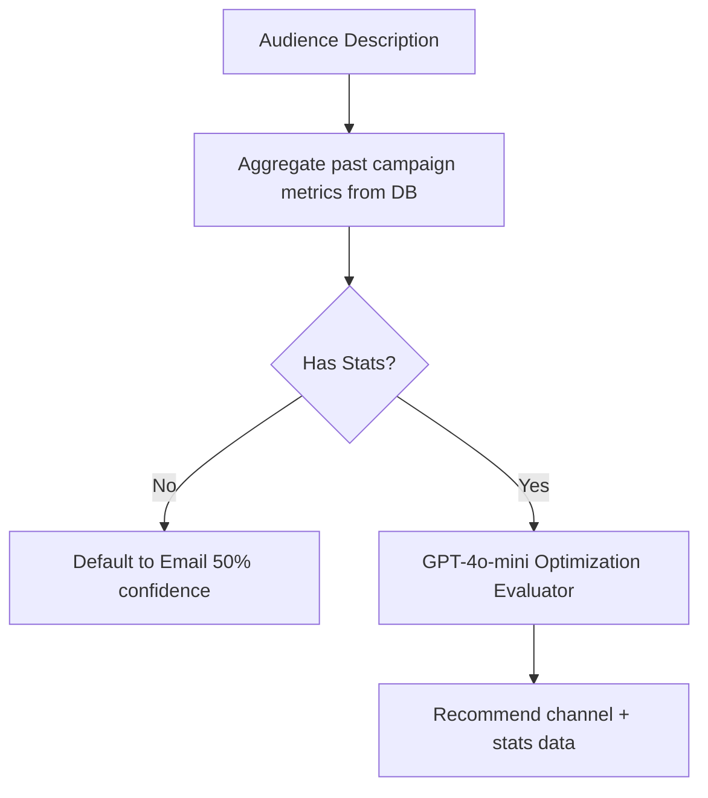

### 4.5 Analytics Agent & Feedback Loop (`analytics-agent.ts` + `campaign.ts`)
Summarizes campaign performance once it is finished and embeds the learnings to close the learning loop.

* **Trigger**: A campaign finishes executing all bulk jobs.
* **Analysis**: Aggregates conversion, click, open, and delivery metrics. Generates a textual summary analyzing top-performing elements and what can be improved.
* **Vector Learnings Layer**: Combines stats and copy insights into a learning string, generates its embedding, and upserts it into `CampaignMemory` using pgvector.
* **Result**: On subsequent runs, Stage 1 will retrieve these embeddings to guide the orchestrator, making the system smarter over time.

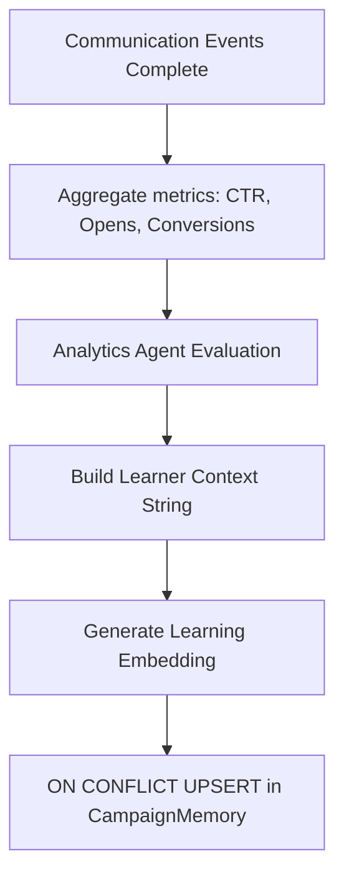
